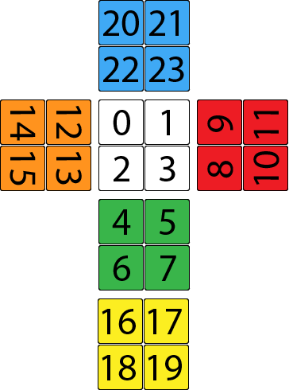
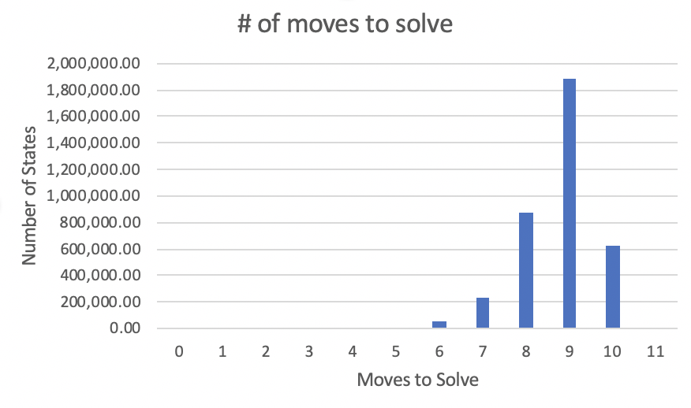

<h3>2x2 Rubik's Cube Solver</h3>

<h4>Dependencies:</h4>
- OpenCV
- Numpy
- Sklearn
`pip install opencv-python scikit-learn numpy`

<h4>How to use:</h4>
- Install dependencies and run ```python index.py```
- Your webcam will open. Hold the cube the cube in any orientation... this is the orientation you will solve it in. Use the spacebar to take a picture of each face in the following order:
    1. Take a picture of the back face. Since you're holding the cube the way you're going to solve it, the back should already be facing your webcam.
    1. Do a y move so that the left side is now in the back. Take a picture.
    1. Do a y move again, take a picture. 
    1. Do a y move again, take a picture.
    1. Do one more y move so that the cube is back in its original orientation. Now do an x move so that the top side is facing the back. Take a picture.
    1. Do two more x moves, so that the bottom side is facing the back. Take a picture.
    1. You have now taken a picture of every face. Do one more x move to return the cube to its original orientation, and wait for the solution to appear in the console.

<h4>How it Works (the basics)</h4>

We use the OpenCV library to translate images of the cube into a single string that represents the state. <br>
The state becomes a string of 24 characters (one for each sticker). <br>
For example: a solved cube with white on top would be entered as "wwwwggggrrrrooooyyyybbbb"

w = white
g = green
r = red
o = orange
y = yellow
b = blue

Order in which to enter state:<br><br>


The program uses a graph to model a 2x2 Rubik's Cube, where each Vertex is a state that the cube can be in and each Edge is the move that would transition from one state to another. To generate this graph, we start with a solved cube. We then generate all of its neighbors by performing every possible move on it. From here, the cycle repeats–for each of the neighbors that was just generated, we find its neighbors, checking to make sure that the resulting state is not redundant (e.g. performing the moves R R' would result in a solved cube, but we already know that we can achieve a solved cube by applying no moves, so the R R' case is ignored). <br><br>

A couple tricks were used to conserve space. First, nodes only store (the node that they came from) and (their state). The states are stored as an array of bytes, which saves considerable space over ints. Additionally, no edges are actually stored because we only care about the path from a node back to the solved state, which we can generate by backtracking. The main space issue is that each state is stored 24 times; one for each of the cube's 24 possible orientations. To avoid this, we only use the use R U and F moves, which essentially locks the back left down corner in place. We've still generated each possible state, but we've avoided redundancy as all states are relative to the back left down corner, which is now fixed.<br><br>

\*\*UPDATE\*\*<br>
I was able to drastically improve the speed at which the program finds solutions with the following approach: instead of starting with the solved state and branching toward the scrambled state, I started with both the solved **AND** scrambled states and branched toward each other.<br><br>

<h4>Visualization of Findings:</h4>
Scramble that will produce the longest solution: F2 U F' U R F' U2 F U' F' R'<br>
Verifies that God's number (the maximum number of moves to solve a cube) is 11 for a 2x2.<br>
Verifies that there are 3,674,160 total states, with the following breakdown<br>

